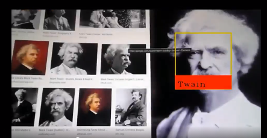

# face_recognition
Face recognition and recording

written in Python 3.7

>If you found information in this project helpful and want to thank me, consider buying me a cup of ☕
>
>[Make a contribution](https://paypal.me/kabanenko?locale.x=en_US)

